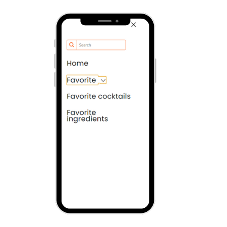
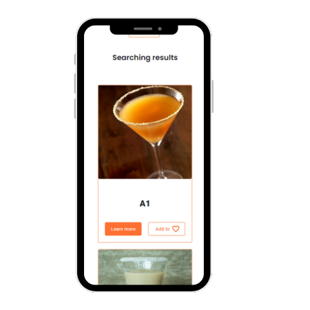

<!--  -->
# 👋Hi ,My name is Yevgeny_Melnyk in l'm is Junior Front-end developer

# Cocktails 🍸
## [link](https://github.com/Zhe1a/Cocktails)
For a developer, it's important to quickly find some cocktail that they might not have even seen before. In this project that was assigned to our self-study group, there were four of us, and we divided the work into sections.
My part was the 'hero' section, where the rendering was implemented based on API requests using fetch. The entire functionality was written in JavaScript, and the rendering of letters was achieved through different screen width conditions

</img>
</img>

# Wallet 👝
## [link](https://github.com/Zhe1a/Wallet)
Sometimes, there's a need to manage one's budget, and this wallet project was developed to track income and expenses. In this team project, I was responsible for the registration and login section. The project was built using React, and requests were made using Axios.
Validation was also implemented during the registration phase, and to enhance password security understanding, a strength indicator was developed. My team and I ensured the project's responsiveness across all devices.

</img></img>

<!--

**Zhe1a/Zhe1a** is a ✨ _special_ ✨ repository because its `README.md` (this file) appears on your GitHub profile.

Here are some ideas to get you started:

- 🔭 I’m currently working on ...
- 🌱 I’m currently learning ...
- 👯 I’m looking to collaborate on ...
- 🤔 I’m looking for help with ...
- 💬 Ask me about ...

- 📫 How to reach me: ...
- 😄 Pronouns: ...
- ⚡ Fun fact: ...!
2)

-->
