# 👋Hi ,My name is Yevgeny_Melnyk and l'm Junior Front-end developer

<!--  -->

# Petly 🐕🐈🐿 [code](https://github.com/Amfiteatr42/React-Node-TeamProject)

For everyone, it's very important to have a friend, someone you can hug and who will always be happy to see you. In this project, I solidified my knowledge of React and also improved data validation that users provide. My area of responsibility in the project was user registration and login. Registration here occurs in two stages – if the user enters incorrect data in the first stage, they won't be able to proceed with registration. All requests are sent to the backend and processed there.

 
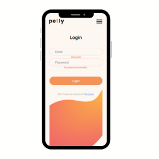

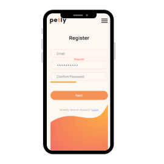
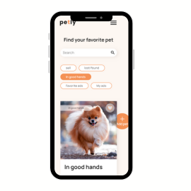
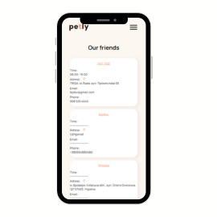

# Cocktails 🍸 [code](https://github.com/Zhe1a/Cocktails)

For a developer, it's important to quickly find some cocktail that they might not have even seen before. In this project that was assigned to our self-study group, there were four of us, and we divided the work into sections.
My part was the 'hero' section, where the rendering was implemented based on API requests using fetch. The entire functionality was written in JavaScript, and the rendering of letters was achieved through different screen width conditions

 
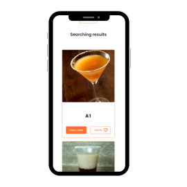
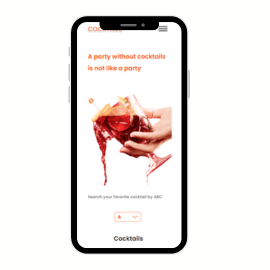
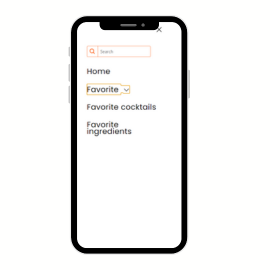
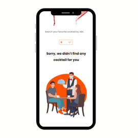

# Wallet 👝 [code](https://github.com/Zhe1a/Wallet)

Sometimes, there's a need to manage one's budget, and this wallet project was developed to track income and expenses. In this team project, I was responsible for the registration and login section. The project was built using React, and requests were made using Axios.
Validation was also implemented during the registration phase, and to enhance password security understanding, a strength indicator was developed. My team and I ensured the project's responsiveness across all devices.

 
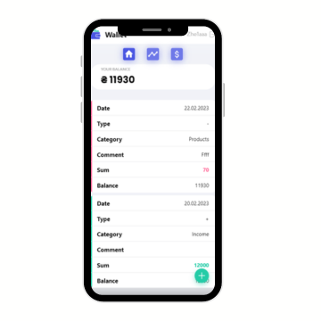
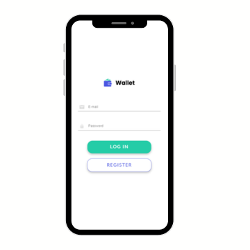</img>
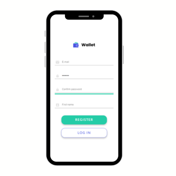</img>
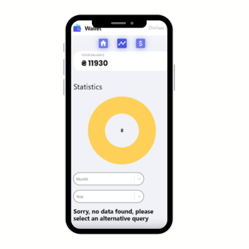</img>

# ico-cream 🍦 [code](https://github.com/Zhe1a/ice-cream)

For a developer, it's very important to sometimes indulge in something sweet, and that's why our team created this website, so that a coder could find something interesting and new for themselves. In this team project, I was responsible for the 'Products' section, where responsive design with breakpoints was applied.

 

</img>
</img>
</img>

